# Encoder-Decoder

视频: <https://www.youtube.com/watch?v=L8HKweZIOmg>

假设我们有这样的一个实际问题需要解决，想把 “Let's go” 英文，翻译成西班牙文。那么这实际是把一个序列转换成另一个序列。这个问题我们称为**sequence-to-sequence(逐序列问题)**，简称**seq2seq**问题

解决 **seq2seq** 问题的其中一种方法，称为 **Encoder-Decoder** model(编码器-解码器模型)

### Encoder

在语言输入的场景中，输入长度不固定，既可以是 `Let's go` 也可以是 `my name is Amy` 等。同样的问题西班牙语也一样。所以我们需要 **Encoder-Decoder** model 能够处理不同长度的输入输出

这里使用 词嵌入层 加上 LSTM 来解决这个问题

首先使用词嵌入的目的是将文本转换成数字，如图:

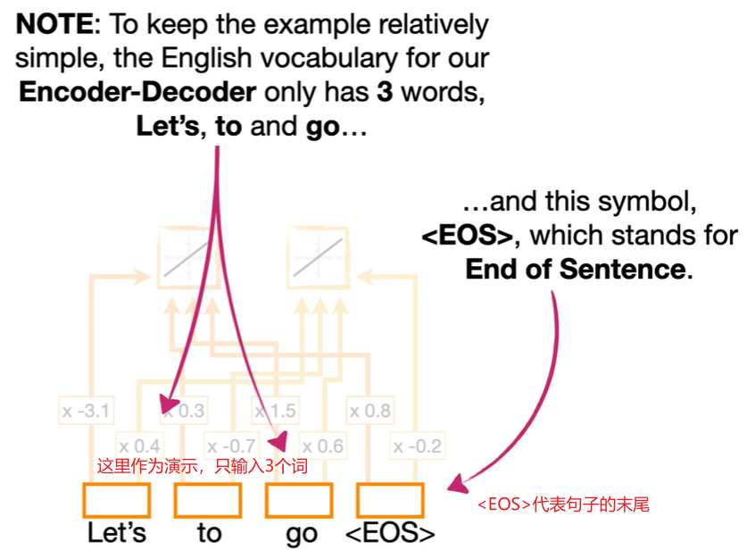

这里，输入的是3个词 `Let's` `to` `go`，实际上可能它们可能是单词或符号的组合，我们称这样的一个组合为 **Token**

上图为了演示，给每个 `Token` 创建了两个嵌入值(即每个Token拥有两个权重，但真实情况可能会有成百上千个)

然后我们将 `Let's go` 作为 LSTM 的输入，如图:

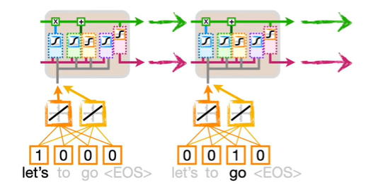

这里要注意的是，我们在 Embedding Layer 和 LSTM 中，使用了相同的权重去应对 `Let's` 和 `go` 这两个输入

到目前为止，我们对 `Let's go` 完成了编码

但是，实际上由于 LSTM 权重过少，实践中通常需要保留更多特征，所以通常会添加更多的 LSTM 来接受输入，如图:

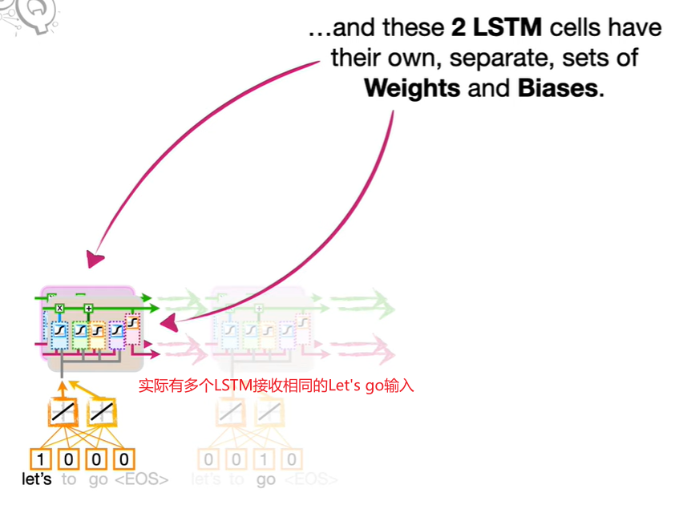

上图为了演示，使用了 2 个 LSTM 接受输入 `Let's go`，不同的 LSTM 将会有各自的权重和偏置

然而这样依然不够，我们需要更多层，来提取特征，所以我们复制这两个 LSTM 单元作为第一层，生成第二层，如图:

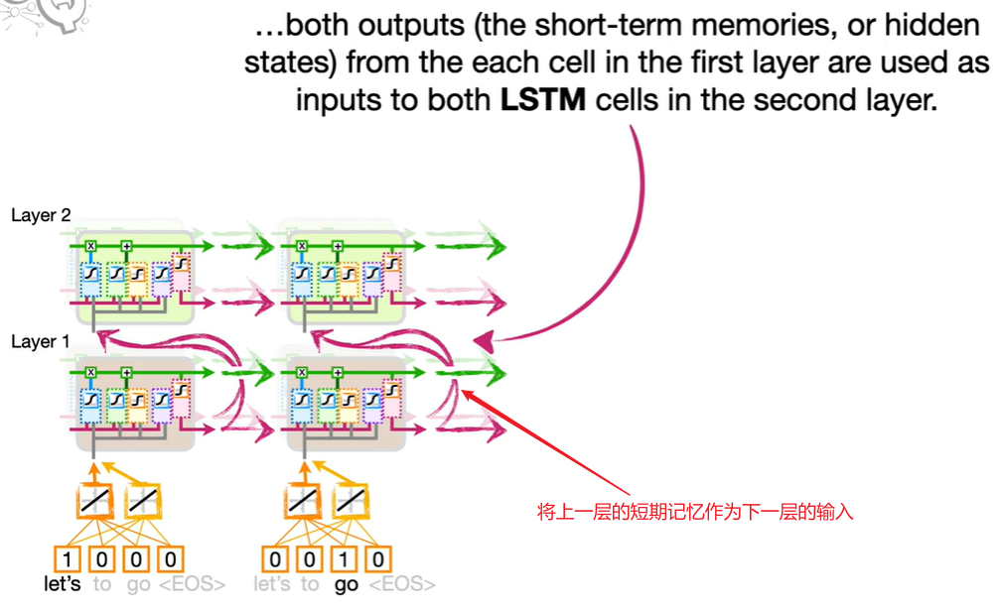

如上图，第一层的短期记忆将作为第二层的输入，第二层也包含 2 个 LSTM 单元 (实践中，会有更多层，每层也有更多的 LSTM 单元)

所有层加在一起就形成了 Encoder 编码器，如图:

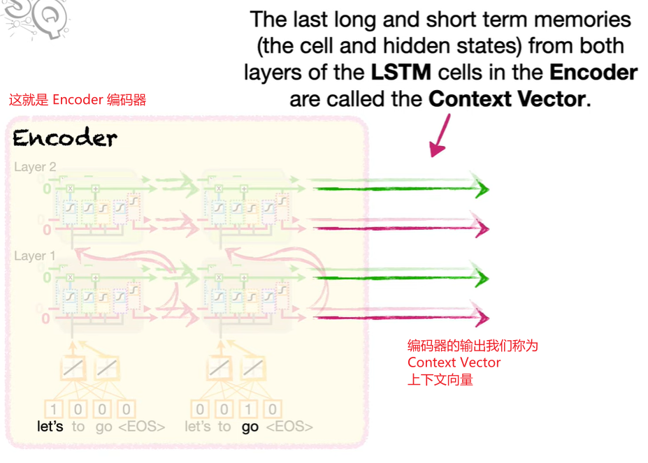

编码器的输出，我们称为 **Context Vector** (上下文向量)

### Decoder

Encoder 输出的 Context Vector 将作为 Decoder 的输入，如图:

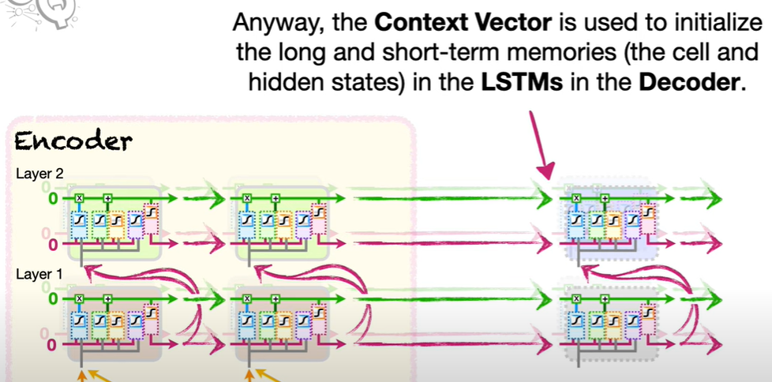

如上图，接受输入的依然是对应层数，每层对应单元数的 LSTM

然后和 Encoder 类似，有一个 Embedding Layer 作为第一层 LSTM 的输入，并且我们人为规定起始输入为 `<EOS>`，如图:

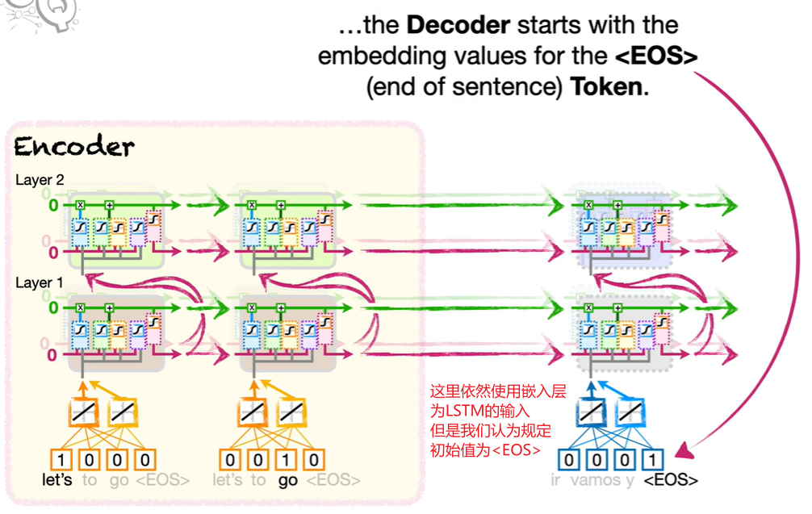

最后，将顶层的短期记忆作为输出，顶层有多少个 LSTM 单元，就有多少个短期记忆输出，该输出还会经历全连接和 `softmax`，如图:

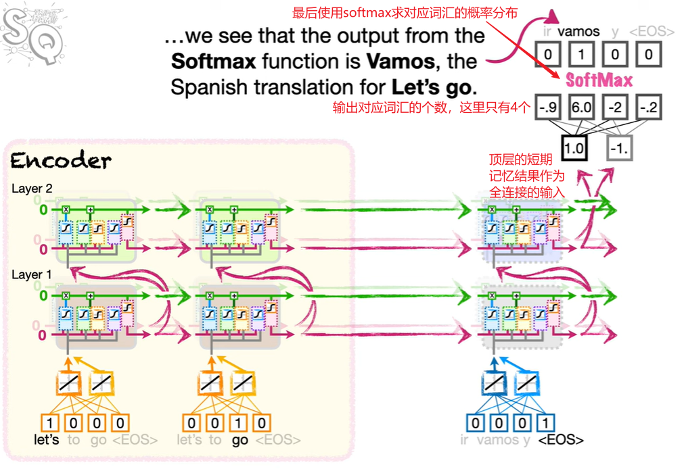

由于输出长度不固定，所以此处还没有解码结束，继续推断结果，如图:

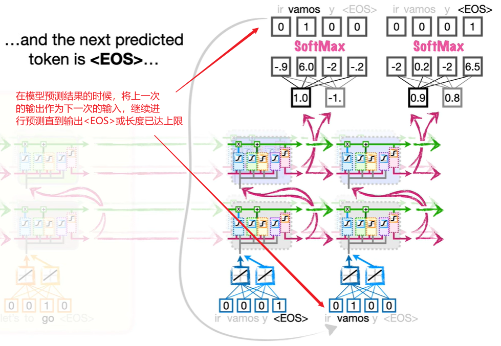

然而在训练的时候，上一次输出的结果也许是错的，此处需要输入正确的结果，如图:

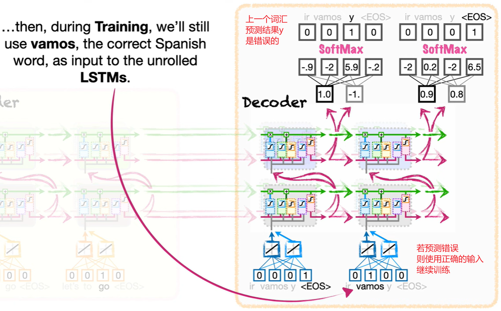

若最后一个结果本因是 `<EOS>`，结果也预测错误的话，则强制停止预测

这个过程称为 **Teacher Forcing** (强制教育)

## 训练方式

训练方法有几种

上图描述的是 free-running mode，自由运行模式，其思想是拿预测的结果作为下一次的输入预测下一个字，这种方法模型很难训练或学到正确的内容

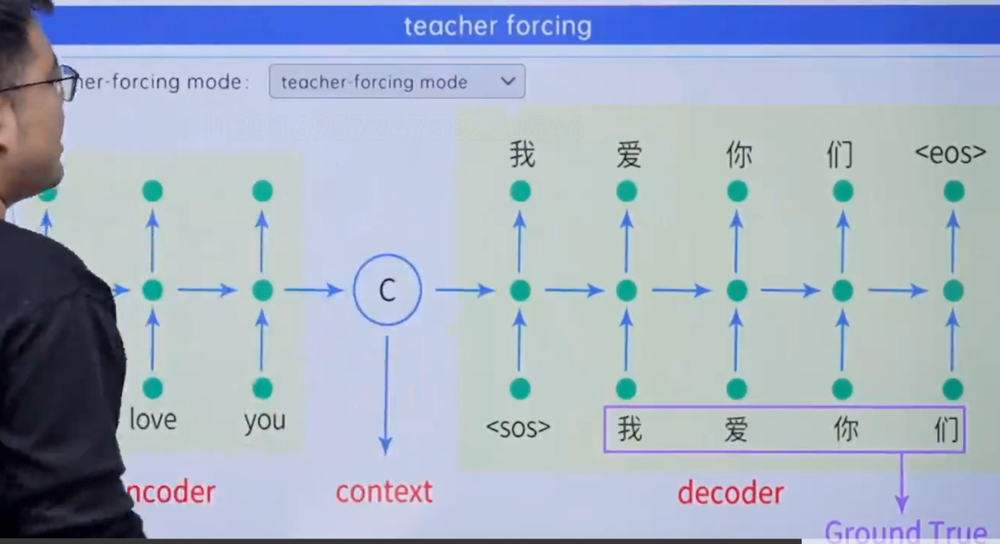

上图的训练方式叫 teacher-forcing mode，也就是教师强迫训练，我们用真实值 Ground True 作为输入训练模型

free-running mode 和 teacher-forcing mode 通常会一块儿使用，先用 teacher-forcing mode 强制教会模型基本信息，再用 free-running mode 让模型更具泛化性

**序列生成模型的训练技术: Scheduled Sampling**:

- **定义:** Scheduled Sampling是一种在训练序列生成模型（如循环神经网络）时使用的技术。在标准的序列生成模型训练中，模型在每一步都使用真实的目标序列数据进行训练。但在Scheduled Sampling中，模型在训练的早期阶段会被引导使用自己生成的序列数据，而不是总是使用真实的目标序列数据。
- **目的:** 这有助于模型逐渐从完全依赖真实数据过渡到能够生成自己的数据，提高其泛化能力。
- **过程:** 在训练开始时，模型主要使用真实数据，但随着训练的进行，模型逐渐增加使用自己生成的数据的比例。这个比例会根据预定的计划（schedule）进行调整。

**代码参考:**

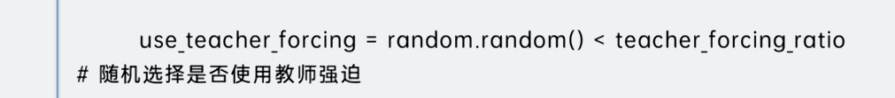

通过一定的比例 `teacher_forcing_ratio` 来控制是否强制压迫学习，通过一定的计划，修改 `teacher_forcing_ratio` 就能达到控制训练的目的

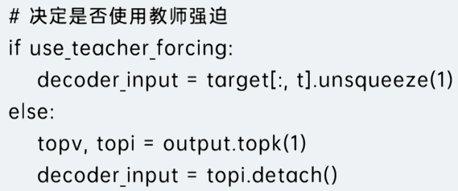

通过判断 `teacher_forcing_ratio` 决定解码器的下一步输入用预测值还是真实标签