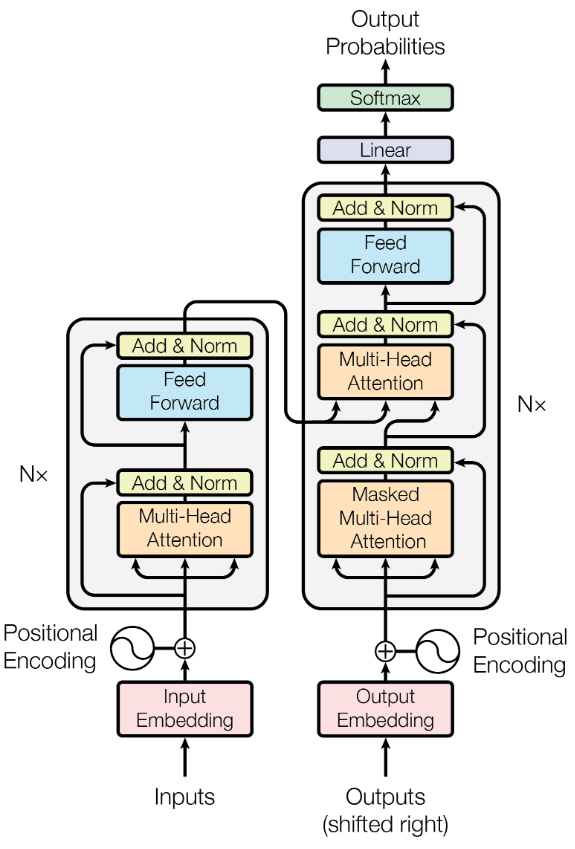

# Transformer架构解析

[Attention Is All You Need](https://arxiv.org/abs/1706.03762)

## 什么是 Transformer

Transformer 是一种 Encoder-Decoder 模型的代码实现，可以视为一种序列的转换器（从输入序列转换为输出序列）

## 架构图



- 图中被框起来的部分就是 Transformer 部分
- 左侧是编码器
- 右侧是解码器
- 图中的 $\text{N}\times$ 代表的是编解码器的层数
- Input Embedding: 将输入进行嵌入操作，如词嵌入，声音嵌入，图片嵌入等
- Positional Encoding: 位置编码
- Multi-Head Attention: 多头注意力
- Add & Norm: 残差连接和**层归一化**
- Feed Forward: 前馈神经网络

此处的 **层归一化** 就是调用 `torch.nn.functional.layer_norm` 进行归一化，用于提升计算速度，模型鲁棒性

注意: 图中框起来部分的外部内容，不属于 Transformer 内部的代码，如:

- 词嵌入
- 位置编码
- Decoder 输出后的 Linear、Softmax

注意: 在最后的 softmax 前面的 linear 和 w2v 中的 fc 共享权重；编码器和解码器使用的词嵌入的嵌入层也共享权重

论文原文，出自: 3.4Embeddings and Softmax

```
Similarly to other sequence transduction models, we use learned embeddings to convert the input tokens and output tokens to vectors of dimension 𝑑model. We also use the usual learned linear transformation and softmax function to convert the decoder output to predicted next-token probabilities. In our model, we share the same weight matrix between the two embedding layers and the pre-softmax linear transformation, similar to [30]. In the embedding layers, we multiply those weights by 𝑑model.
```

## 自注意力 Self-Attention

自注意力指的是编码器内部或解码器内部，计算自己内部的注意力值

这就意味着 QKV 都来自于编解码器自己内部

例如: 编码器内部的自注意力称为 Encoder Self-Attention；解码器内部自注意力称为 Decoder Self-Attention

## 编解码器注意力 Encoder-Decoder Attention

Q 来自于解码器，KV 来自于编码器，这样查询出来的结果我们称为 Encoder-Decoder Attention