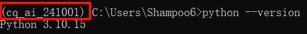

# python 环境搭建

## python 解释器

- 系统python: cmd 命令行中默认使用的 python 就是系统 python
- venv python 虚拟环境: 专供某个文件夹对应的项目使用
- conda 环境: 使用一款 Anaconda 的工具管理我们的 python 环境

### 使用 python 命令运行 python 脚本

python 脚本是以 `.py` 结尾的文件，我们可以用 python 命令执行 python 脚本，例如:

```shell
python 脚本.py
```

## Anaconda

### 什么是 Anaconda

python 环境管理工具，还提供一些常用内置的其他工具，例如: spider，jupter

为了安装 anaconda 的核心功能（环境管理），我们可以安装 miniconda

### 为什么用 Anaconda

anaconda 可以创建一个隔离的环境，解决各个软件包之间版本冲突的问题

便于维护管理环境

### 什么是 Miniconda

只保留 anaconda 核行功能（环境管理）的缩水版 anaconda

### 安装 Miniconda

### conda 命令

```shell
# 帮助文档
conda --help
# 创建环境
conda create --name cq_ai_241001 python=3.10
```

激活环境

```shell
conda activate cq_ai_241001
```

激活后如图:



退出激活

```shell
conda deactivate
```

查看环境

```shell
conda env list
```

删除环境

```shell
conda env remove --name cq_ai_241001
```

安装和卸载软件包

```shell
# 安装
conda install <package_name>
# 卸载
conda uninstall <package_name>
```

### pycharm 配置 conda

添加本地解释器如图:


使用 `where conda` 命令，查看 `conda` 的可执行程序路径


