# ModeScope（魔搭网）

> 免费的开源网站

https://modelscope.cn/

进入`我的Notebook`

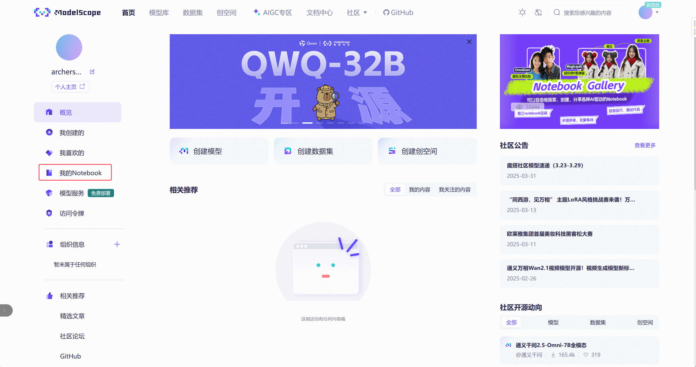

进入CPU环境中：

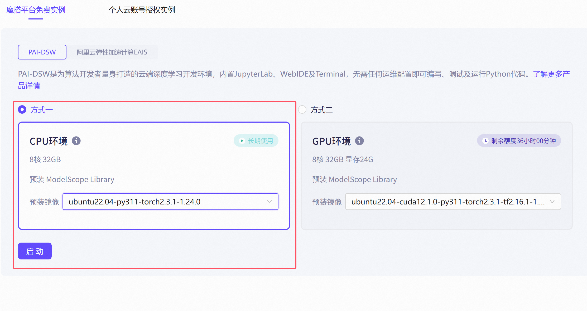

启动后，点击`查看NoteBook`

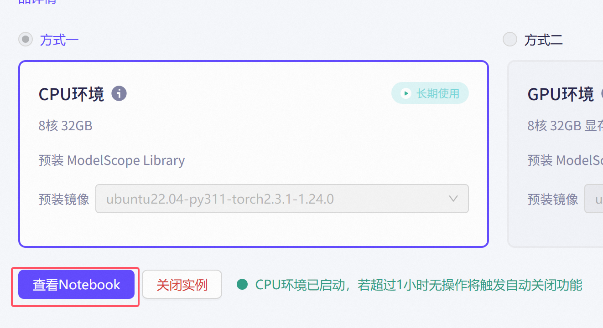

进入该环境时，为`jupyter 环境`

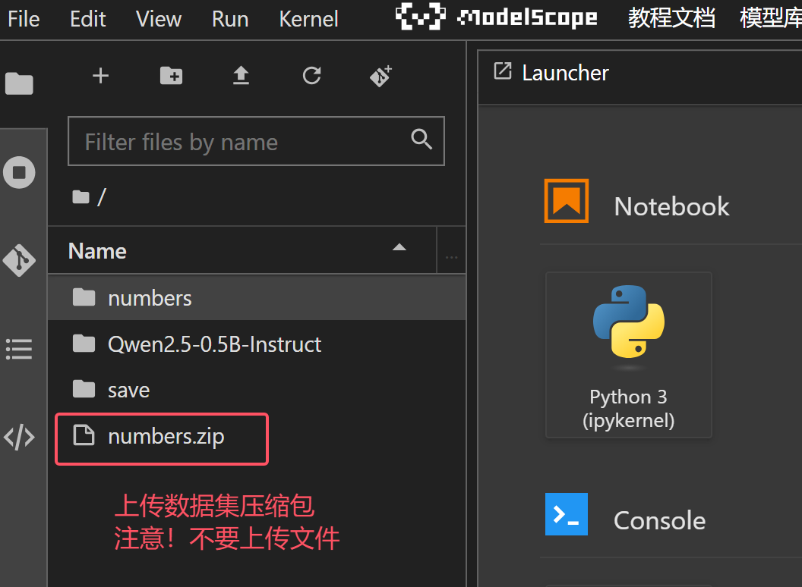

上传好文件之后，进入Linux操作控制台

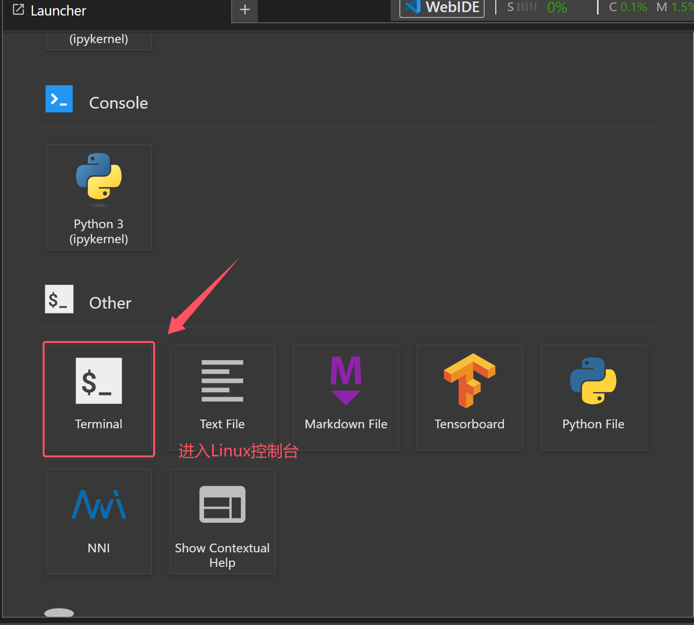

在控制台中解压刚才上传的文件

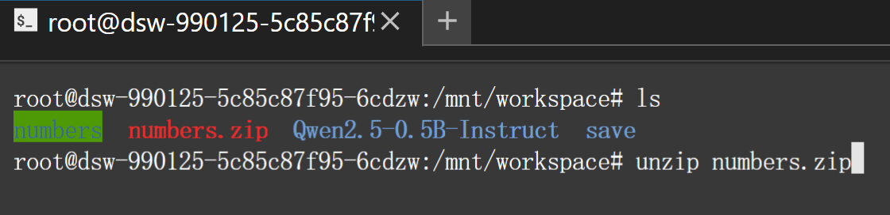

在左边的列表中，右键选择`New Notebook`

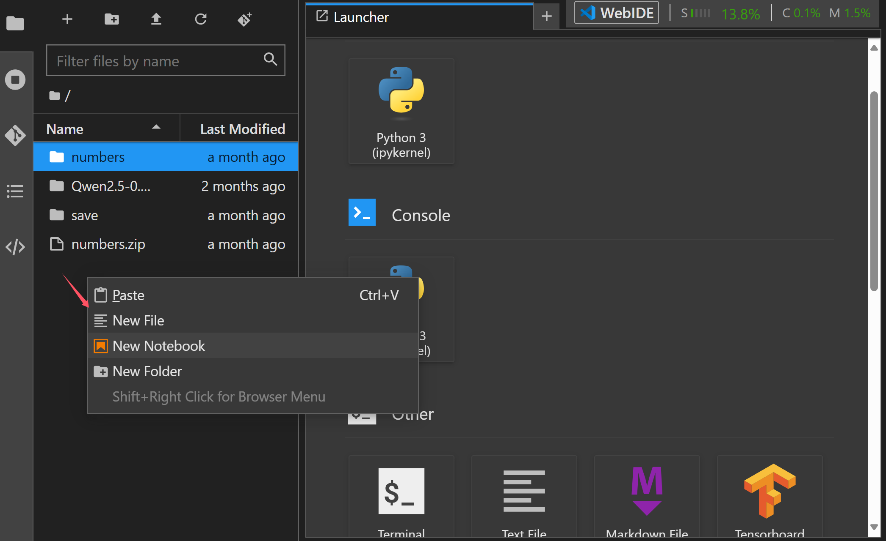

选择需要运行的环境，此处默认选择select

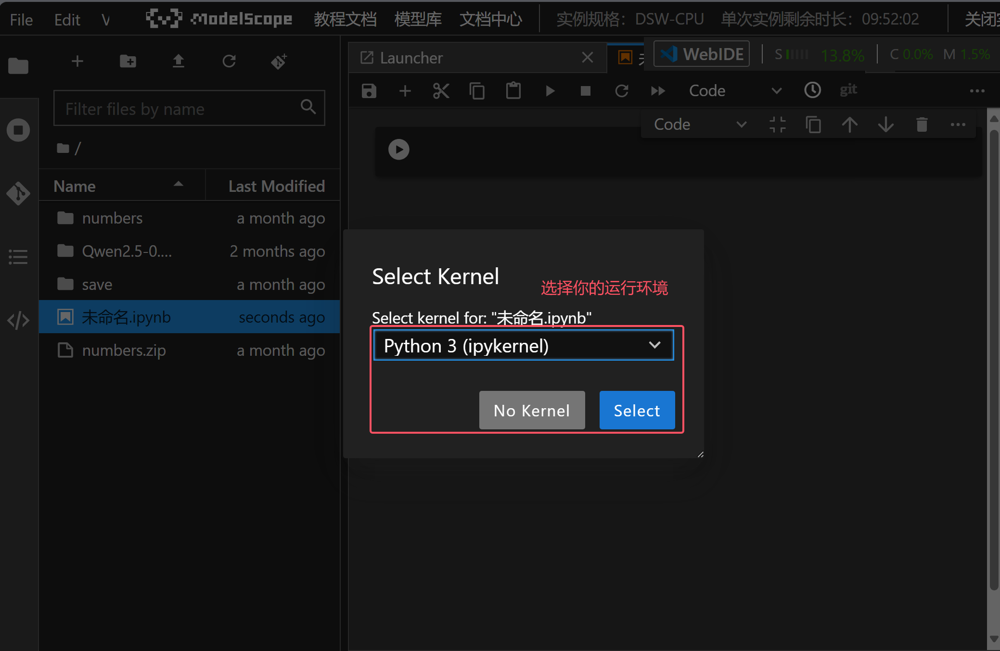

上述选择环境后，可以测试一下环境

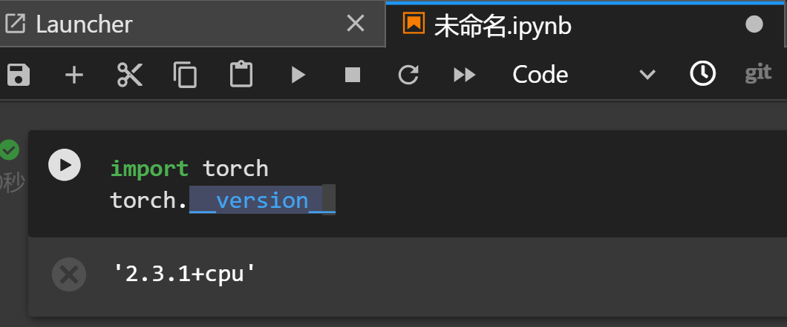

如果当前环境缺少需要的库，则可以直接在代码行中输入（在代码中可以用任何pip命令）：

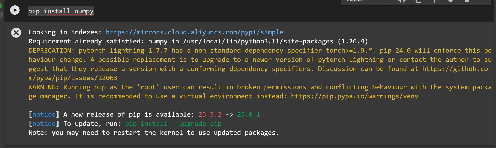

我们将torch_utils中的代码（因为主代码中引用了关于train_utils的内容），先放入Notebook中，

执行该代码（选择**运行键**）

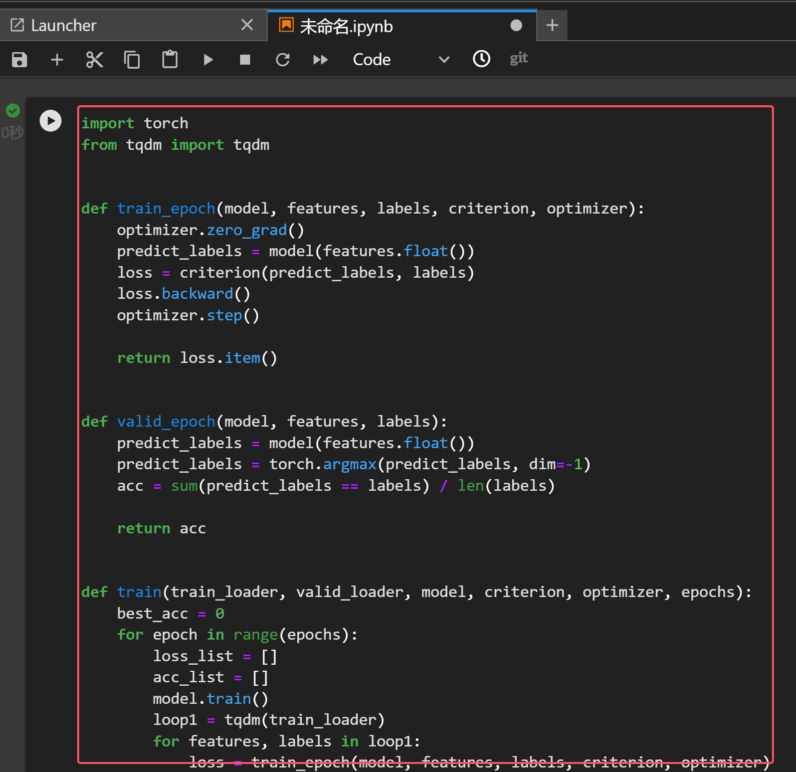

上述代码执行完成后，添加新的代码块

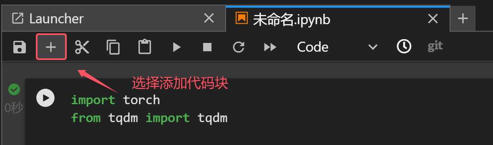

以下就是新的代码块

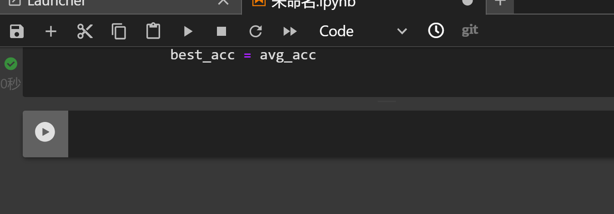

将主代码(数据识别.py)文件中代码，放入新的代码块

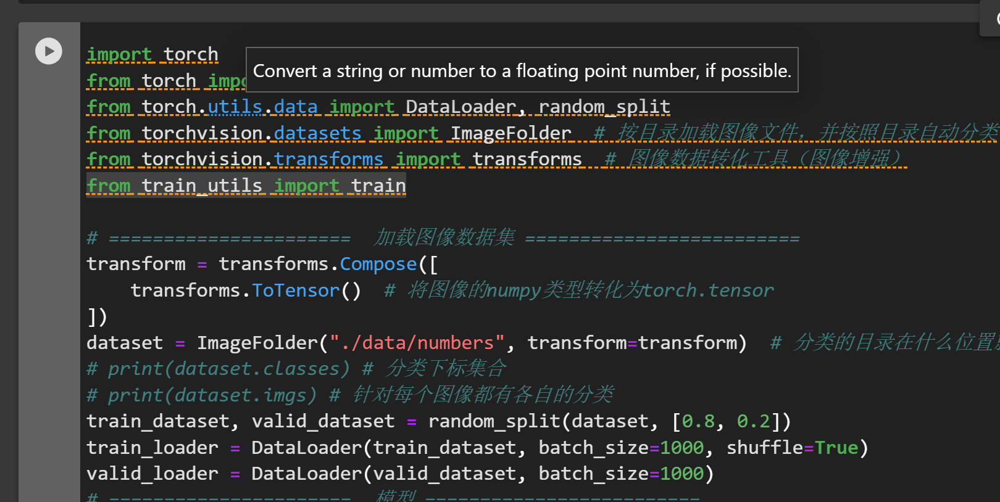

上述代码中需要删除已经执行过的train_utils的引入

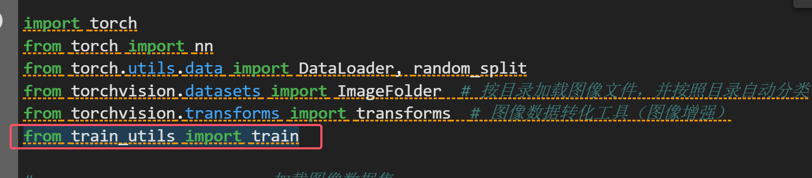

修改当前的加载目录为新的目录

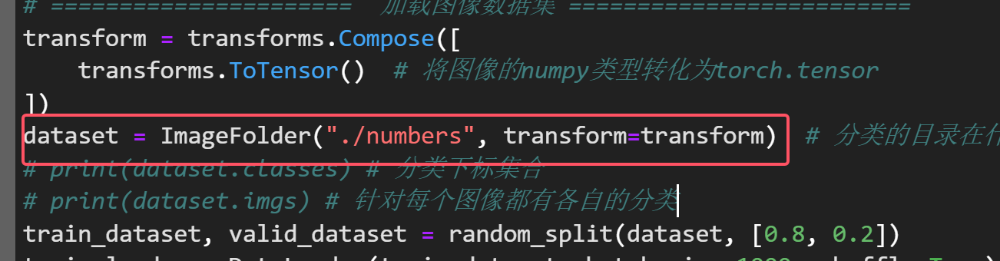

然后将主方法的代码，删除，并在新的代码块中粘贴

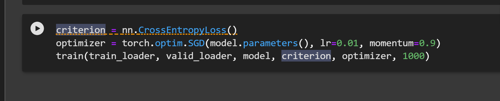

先运行前面的代码内容

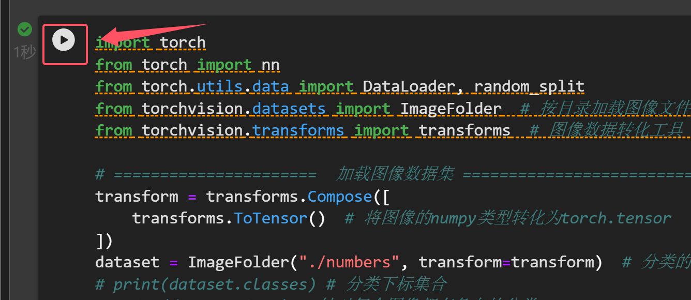

为了保存模型，需要新建`save`目录在左侧

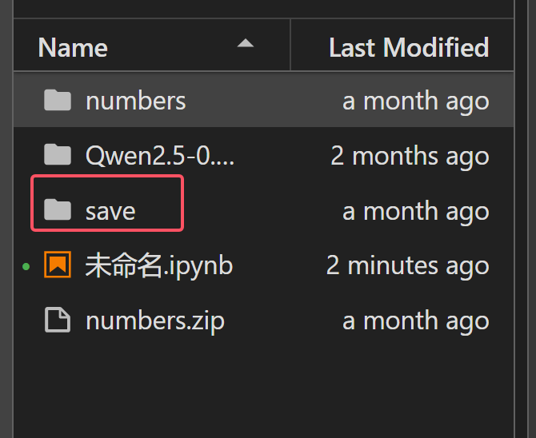

选择运行最后的主代码

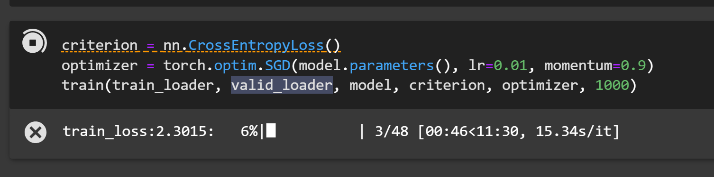

可以在右上角查看运行占用情况。

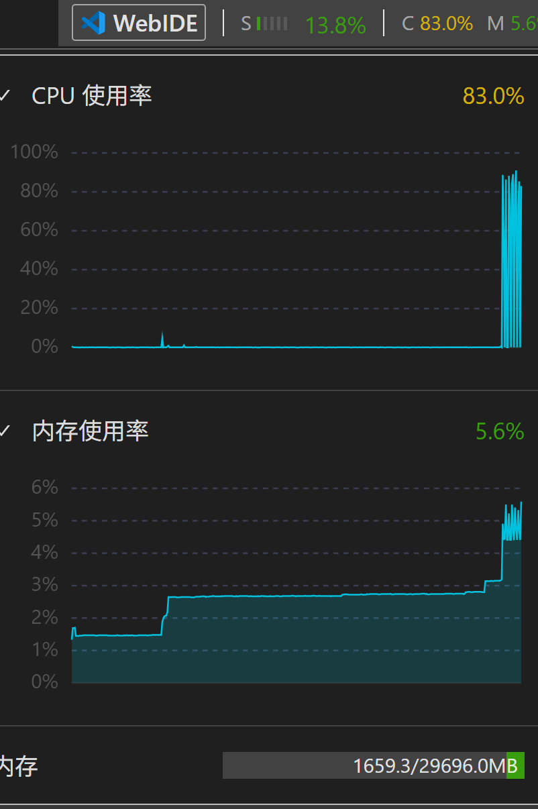

运行完成后，去将save下保存的模型，取出（右键下载它，到本地）