## 卷积

卷积（Convolution）是一种由两个函数生成第三个函数的特殊数学运算，其本质是一种积分变换

在图像识别中，卷积主要做相乘和相加两种运算，力求将图像中的特征进行提取。比如边缘、角

### 卷积的目的

以`数字识别`为例，卷积的最终目标就是识别我们所绘制的内容


我们提取矩阵中的一部分，可以发现矩阵中的像素值都是0~255的

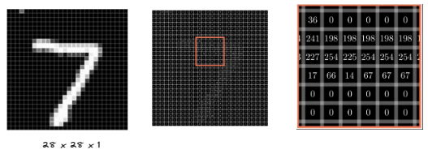

### 卷积核

卷积核是 一个小矩阵，被用作提取图像的特征

在前向传播学习过程中,我们已知

$$
y = f(wx + b)
$$

假定我们有一个矩阵，作为我们的卷积核，它此时就是前向传播中的`w`，而`b`作为卷积核偏置项令`b=2`

$$
\left[
\begin{matrix}
1 & 0 & 0 \\
0 & 1 & 0 \\
0 & 0 & 1
\end{matrix}
\right]
$$

且作为特征输入的图像矩阵，就如同前向传播中，我们所学习的`x`,但由于上述矩阵太复杂，我们将其简单定义。

我们近似认为它就是输入的`7`

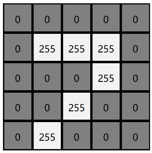

此时，你肯定会认为 `wx + b`就可以了，但事实上我们需要细化这一过程


## 卷积过程

### 定义卷积核

我们给定了两个卷积核对我们的图像内容进行卷积

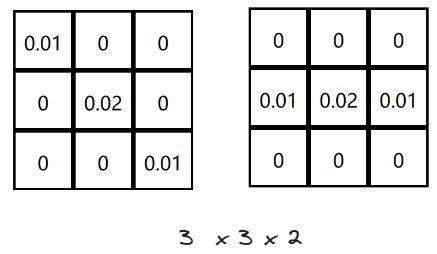

不同于矩阵相乘运算，卷积的过程分为相乘与相加。由于卷积核大小为`3 x 3`,我们在特征图中同样标注出一块`3 x 3`的区域，
对于这块区域，我们采用对位相乘的方式，去计算它, 并将他们的和计算出来为`5.1`

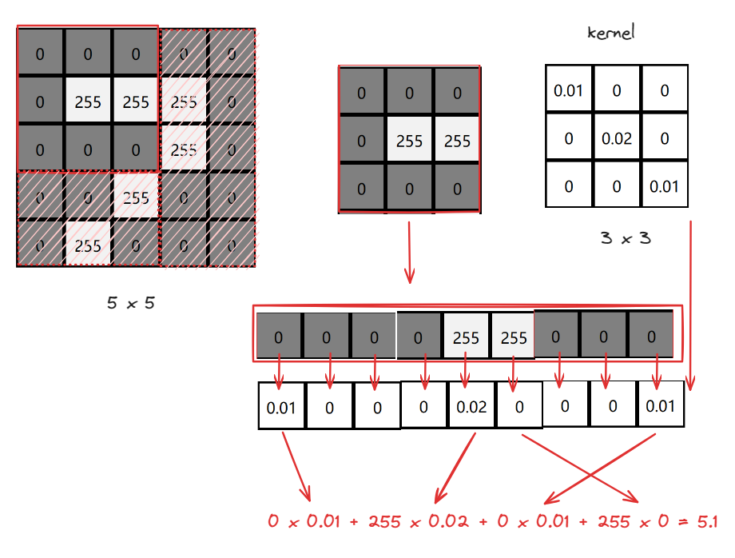

接着我们再开始下一轮计算，由于前面的`3 x 3` 区域，已经被计算，此时我们需要向右平移一个单元格，开始计算

而这里的`向右平移一个单元格`就叫做步长`stride`，此时`stride = 1`

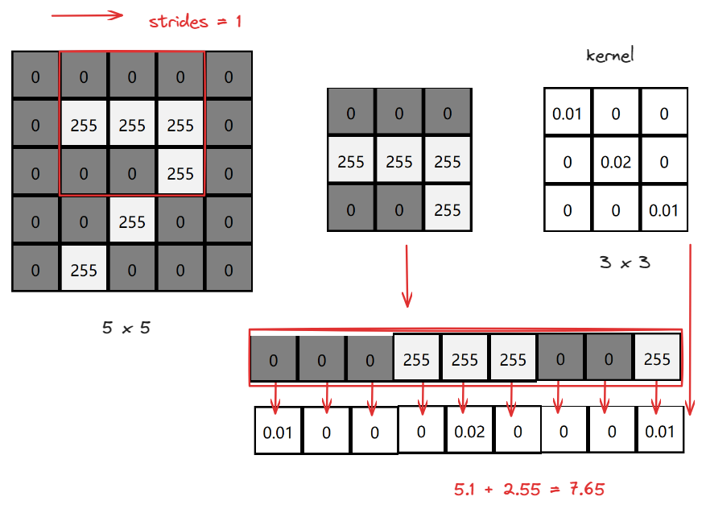

当卷积过程持续到右侧边界时，我们便往下移动一个单元格，且移动到最左侧再开始卷积。
过程如下：

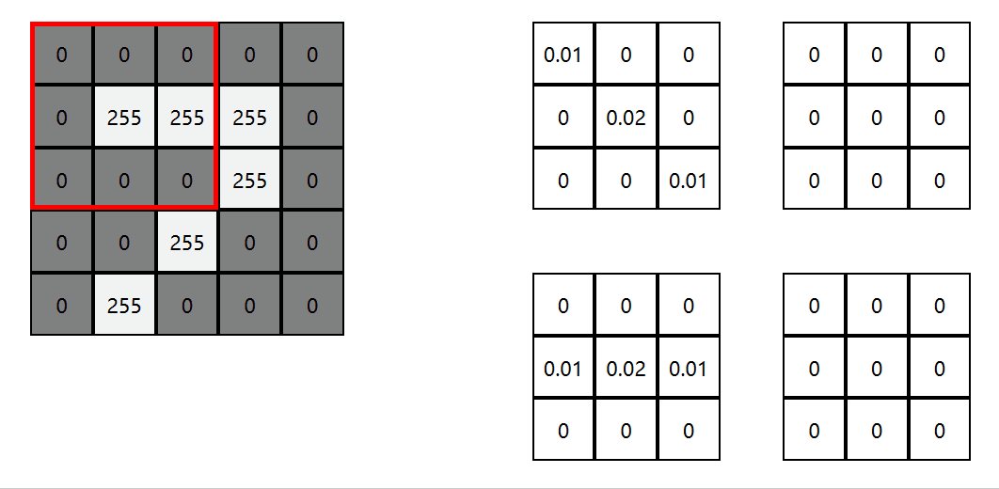

### 偏置项

上述的卷积完成后，实际上要加上每个卷积核准备的偏执项，也就是`wx + b`中的`b`值，此处我们的`b`默认为0

### 卷积核大小为什么是奇数

**中心像素**：奇数大小的卷积核具有一个明确的中心像素，可以使得输入图像上的像素点在卷积过程中具有空间对称性。这有助于在图像处理过程中保持空间信息的连续性。而偶数大小的卷积核没有明确的中心像素，可能导致空间上的信息失真。    

**填充方便**：在某些卷积神经网络应用中，为了保持输入和输出图像的尺寸相同，需要对输入图像进行填充。对于奇数大小的卷积核，填充大小很容易计算。通常，我们可以使用卷积核大小减1除以2得到的值作为填充大小。对于偶数大小的卷积核，选择合适的填充大小会更加复杂。    

**实际经验**：实际应用中，奇数大小的卷积核（如3x3，5x5）在很多情况下都取得了良好的性能。在深度学习实践中，大多数优秀的卷积神经网络模型（例如VGG，ResNet等）都采用了奇数大小的卷积核，这表明它们在实际问题中具有较好的表现。    

**参数数量**：较小的卷积核意味着较少的参数数量，这有助于减小计算复杂度和内存占用。在某些情况下，采用多个较小卷积核的串联可以实现与较大卷积核相同的感受野，同时保持计算效率。

### 卷积步长

卷积操作中的步长（Stride）是指卷积核在图像上移动的步长。步长的大小直接影响卷积操作的结果和特征图的尺寸。在卷积操作中，步长的大小可以通过调整卷积核的移动步长来实现。例如，当步长为1时，卷积核每次移动一个像素；当步长为2时，卷积核每次移动两个像素

**步长的大小对卷积操作的结果和特征图的尺寸有着重要的影响**

- 当步长较小时，卷积操作可以更加细致地提取图像特征，但是特征图的尺寸会变大，导致计算量增加。

- 当步长较大时，卷积操作可以更快地提取图像特征，计算量会减少，但是特征图的尺寸会变小，可能会丢失一些重要的特征信息。

### 卷积反向传播

在基于偏执项的基础上，我们会使用激活函数计算最终的结果，例如结果为5.1 ，使用ReLu作为激活函数，由于公式

$$ Relu=max(0,x) $$

函数图为：


则结果为5.1

### 卷积结果

一般来讲，卷积结果指的是将原本的特征输入图中的特征进行提取，这里我们分享一个数字识别卷积的可视化过程


通过上述的动画，我们可以发现卷积实际上将原本图像中的某一特征进行提取。

### 卷积核的数量

由此我们可以总结：

1. 卷积核的数量 与 卷积后的通道数量是相同的

2. 卷积核的数量越多，则关于原始输入图的特征提取位置也就更多，数量少，则提取的特征就较少。

### Padding

上述的卷积操作中，有缺点：

- 每当我们卷积一次图像就会变小，卷积几次图像就会变得非常小，这并不是我们想看到的
- 图像角落和边缘的像素卷积过程中被使用到的次数非常少，而其他地方的像素被多次重叠使用，丢失了边界信息

为了`解决丢失边界信息` 以及 `防止图像变小` 我们可以尝试在原图外层填充 0 

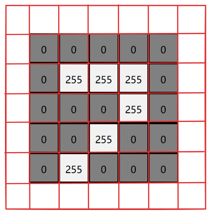

这样我们在进行卷积时，既可以防止`丢失边界特征`,又可以`防止图像变小`

在深度学习中padding参数有两种`valid` 和 `same`两种：

VALID:对输入特征图不做任何操作，则`输出的特征图大小 = （输入图宽度 - 卷积核大小）/ 步长 + 1`  且结果需要向下取整

SAME：对输入特征图由右下角向左上角进行填充操作，则`输出的特征图大小 = 输入图宽度 / 步长` 且结果需要向上取整


## 标准卷积分类


### 二维卷积（单通道卷积版本）

之前所讲`卷积`相关内容其实真正意义上叫做`二维卷积（单通道卷积版本）`,即只有一个通道的卷积。

如下图，我们对于卷积核（kernel）的描述一般是大小3x3、步长（stride）为1、填充（Padding）为0（VALID）


### 二维卷积 （多通道版本）

彩色图像拥有R、G、B这三层通道，因此我们在卷积时需要分别针对这三层进行卷积

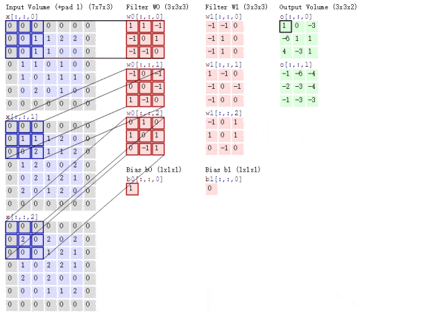

最后将三个通道的卷积结果进行合并（元素相加），得到卷积结果


### 三维卷积

卷积由三个维度（高度、宽度、通道),沿着输入图像的3个方向进行滑动，最后输出三维的结果

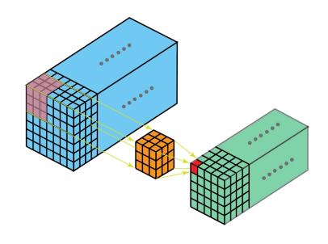

### 1x1 卷积

当卷积核尺寸为1x1时的卷积，也即卷积核变成只有一个数字

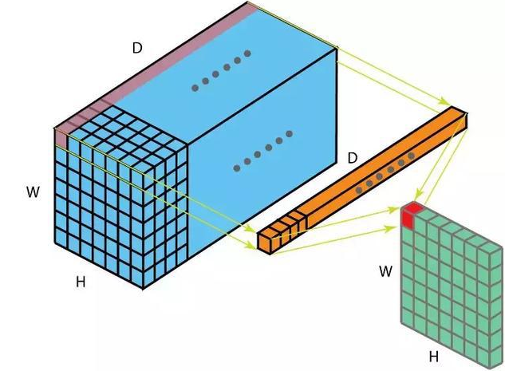

---

## 反卷积（转置卷积）

卷积是对输入图像及进行特征提取，这样会导致尺寸会越变越小，而`反卷积`是进行相反操作。
只是并不会完全还原到跟输入图一样，只是保证了与输入图像尺寸一致，主要用于想象采样。
从数学上看，`反卷积`相当于是将卷积核转换为稀疏矩阵后进行转置计算。也被称为`转置卷积`

如图，在2x2的输入图像上使用步长1，边界全0填充的3x3卷积核，进行转置卷积（反卷积）计算，
向上采样后输出的图像大小为4x4


---

## 空洞卷积（膨胀卷积）

为扩大感受野，在卷积核俩面的元素之间插入空格“膨胀”内核，形成“空洞卷积”（或称膨胀卷积），
并用膨胀率参数`L`表示要扩大内核的范围，即在内核元素之间插入`L-1`个空格。当`L=1`时，则
内核元素之间没有插入空格，变为标准卷积。图中未`L=2`的空洞卷积

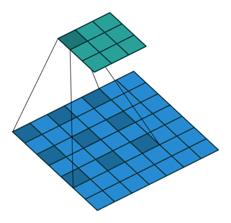

---

## 可分离卷积

### 空间可分离卷积

空间可分离卷积是将卷积核分解为两项独立的核分别进行操作。在数学中我们可以将矩阵分解：

$$
\left[
\begin{matrix}
-1 & 0 & 1 \\
-2 & 0 & 2 \\
-1 & 0 & 1
\end{matrix}
\right]=
\left[
\begin{matrix}
1 \\
2 \\
1
\end{matrix}
\right]\times
\left[
\begin{matrix}
-1 & 0 & 1 
\end{matrix}
\right]
$$

所以对3x3的卷积核，我们同样可以拆分成 3x1 和 1x3 的两个卷积核，对其进行卷积，
且采用可分离卷积的计算量比标准卷积要少


### 深度可分离卷积

深度可分离卷积由两部组成：深度卷积核1x1卷积，我们可以使用`Animated AI`官网的图来演示这一过程

图1：输入图的每一个通道，我们都使用了对应的卷积核进行卷积。 通道数量 = 卷积核个数


图2：完成卷积后，对输出内容进行`1x通道数`的卷积


## 扁平卷积

扁平卷积是将标准卷积拆分成为3个`1x1`的卷积核，然后再分别对输入层进行卷积计算。

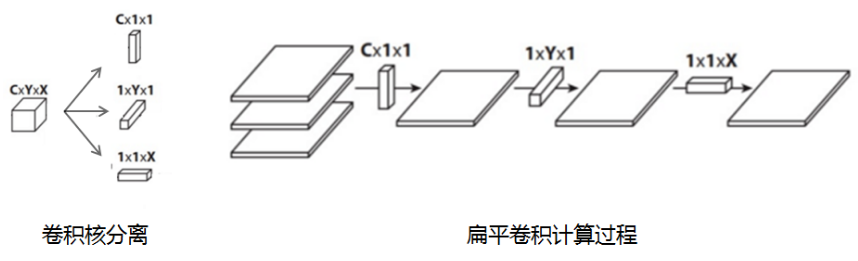

## 分组卷积

2012年，AlexNet论文中最先提出来的概念，当时主要为了解决GPU显存不足问题，将卷积分组放到两个GPU中并行执行。

在分组卷积中，卷积核被分成不同的组，每组负责对相应的输入层进行卷积计算，最后再进行合并。

下图中卷积核被分成两个组，前半部负责处理前半部的输入层，后半部负责后半部的输入层，最后将结果组合。

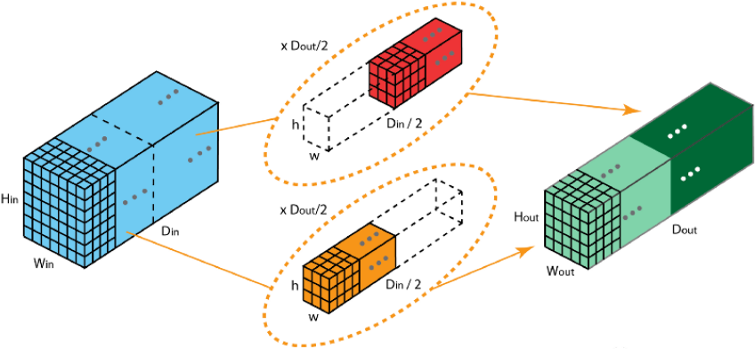

## 混洗分组卷积

分组卷积中最终结果会按照原先的顺序进行合并组合，阻碍了模型在训练时特征信息在通道间流动，削弱了特征表示。
混洗分组卷积，主要是讲分组卷积后的计算结果混合交叉在一起输出。


```python

```
