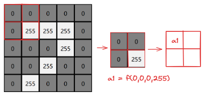
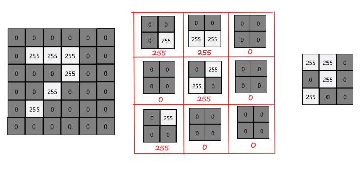
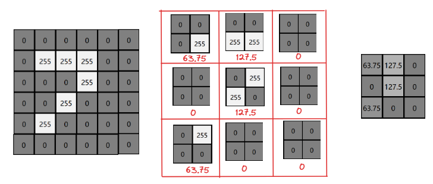
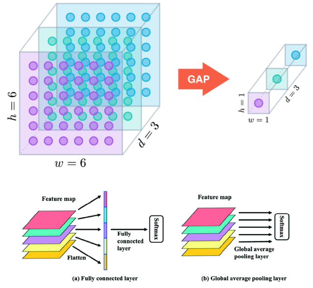
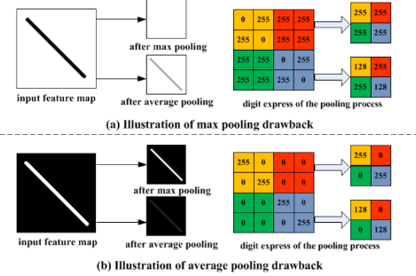
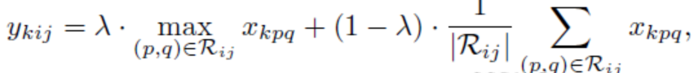
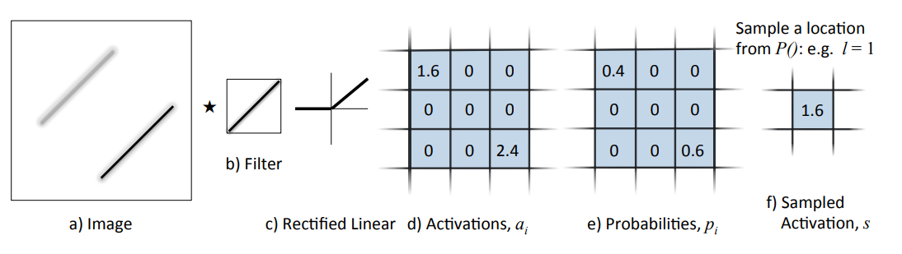

## 池化

### 什么是池化

池化(Pooling)是一种用于减少卷积神经网络(CNN)中特征图大小的操作。它通过特征图上的布局区域进行聚合
，得到一个更小的特征图。

### 池化层作用

池化层大大降低了网络模型参数核计算成本，也在一定程度上降低了网络过拟合的风险，概括如下：

 - 增大网络感受野
 
 - 抑制噪声，降低信息冗余
 
 - 降低模型计算量，降低网络优化难度，防止网络过拟合
 
 - 使模型对输入图像中的特征位置变化更加鲁棒
 
 ### 池化层原理
 
 

 
 **增大感受野**
 
 我们希望用更少的像素可以尽可能观测到上一层图像的尽可能多的特征（也即增大感受野）
 
 **抑制噪声，降低信息冗余**
 
 在获取更少像素的同时，可以极大地削减前一层图像中的细节，当然也包含了一些噪点以及对结果正确性产生影响的部分
 
 **降低计算量**
 
 理论上说，池化过后将得到更少的像素，在参与下一次卷积元素或者全连接运算时，运算次数会明显下降。
 
 **模型更加鲁棒性**
 
 池化在增大感受野的同时，也会尽可能的延续上一层图像的特征，如果上一层是phone13，池化后就是iphone13mini
 
 ### 常见的池化层类型
 
 #### 1.Max Pooling（最大池化）
 
 最大池化（MaxPooling）是讲输入的图像划分为若干个矩形区域，对每个子区域输出最大值。
 
 其定义如图，一个6x6的特征领域内的值，用一个2x2的filter，进行步长为2的扫描
 
 
 
对于最大池化操作，只选择每个矩形区域中的最大值进入下一层，而其他元素将不会进入下一层。所以最大池化提取特征图中响应最强烈的部分进入下一层，这种方式摒弃了网络中大量的冗余信息，使得网络更容易被优化。同时这种操作方式也常常丢失了一些特征图中的细节信息，所以最大池化更多保留些图像的纹理信息。

#### 2.Average Pooling (平均池化)

平均池化（Average Pooling）是讲输入的图像划分为若干个矩形区域，对每个区域输出元素的平均值。

 其定义如图，一个6x6的特征领域内的值，用一个2x2的filter，进行步长为2的扫描
 
 
  
 平均池化取每个矩形区域中的平均值，可以提取特征图中所有特征的信息进入下一层，而不像最大池化只保留值最大的特征，所以平均池化可以更多保留些图像的背景信息。


#### 3.Global Average Pooling(全局平均池化)

参考论文：https://arxiv.org/pdf/1312.4400.pdf

**背景**

传统的卷积神经网络在网络的较低层执行卷积。对于分类任务，最后一个卷积层的特征图被矢量化并输入全连接层，然后是softmax逻辑回归层。这种结构将卷积结构和传统的神经网络分类器联系起来，它将卷积层视为特征提取器，并以传统方式对生成的特征进行分类。然而全连接层容易过拟合，从而影响了整个网络的泛化能力。由Hinton等人提出的dropout作为一个正则化器，随机地在训练时将全连接层的一半激活设为0，它提高了泛化能力，大大防止了过拟合。

**定义**

本文提出了global average pooling来代替CNN中传统的全连接层。在最后一个卷积层为分类任务中的每个类别生成一个特征图。没有在特征图的后面添加全连接层，而是取每个特征图的平均值，这些特征图的平均值组成的向量直接送入softmax层。同全连接层相比，gap的一个优点是，它强制了特征图和类别之间的对应关系，更加适合卷积结构。因此，特征图可以很容易地解释为类别置信度图。另一个优点是gap没有要优化的参数，因此能避免过拟合。此外，gap汇总了空间信息，对输入的空间变换也更鲁棒。



#### 4.Mix Pooling（混合池化）

参考论文：https://www.sciencedirect.com/science/article/pii/S131915782100104X

**背景**

平均池化与最大池化的缺点(以下问题会在反池化中被放大)



**定义**

采用了类似dropout的机制，增强了泛化能力

公式：



根据λ的0、1值选择，随机选择平均池化与最大池化方式


#### 5.Stochatic Pooling（随机池化）

参考论文：https://arxiv.org/pdf/1301.3557.pdf

**定义**

随机池化Stochastic Pooling是Zeiler等人于ICLR2013提出的一种池化操作。随机池化的计算过程如下

- 先将方格中的元素同时除以它们的和sum，得到概率阵
- 按照概率随机选中方格
- pooling得到的值就是方格位置的值

随机池化只需对特征图中的元素按照其概率值大小随机选择，即元素值大的被选中的概率也大，而不像max-pooling那样，永远只取那个最大值元素，这使得随机池化具有更强的泛化能力



## 池化公式

同`Padding=VALID`卷积公式一致: `(输入的宽度 - 卷积的宽度) / 步长 + 1`,且结果需要向下取整。


```python

```
