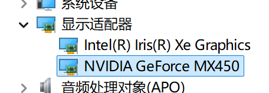
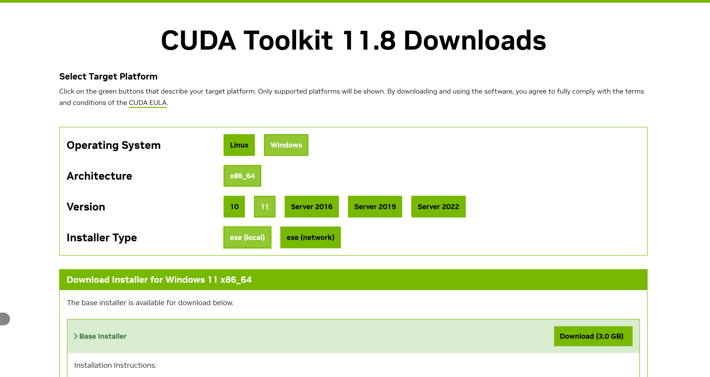
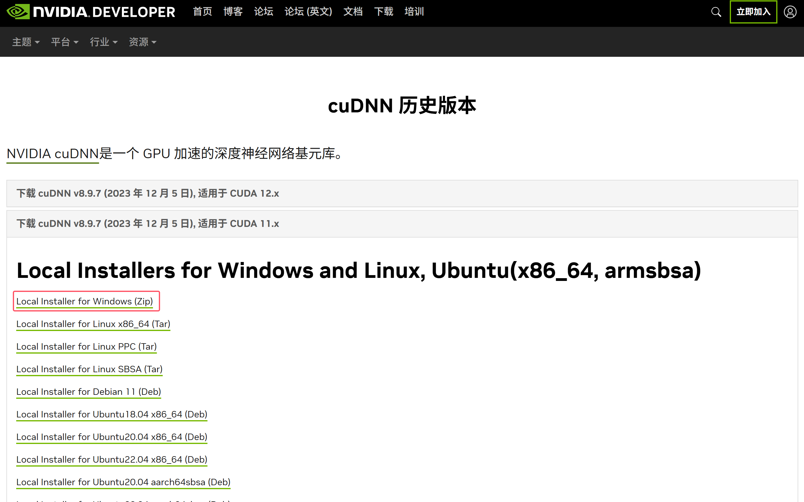
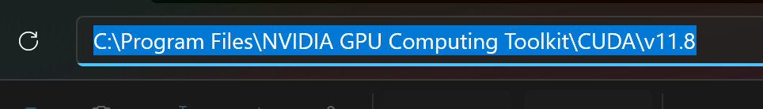
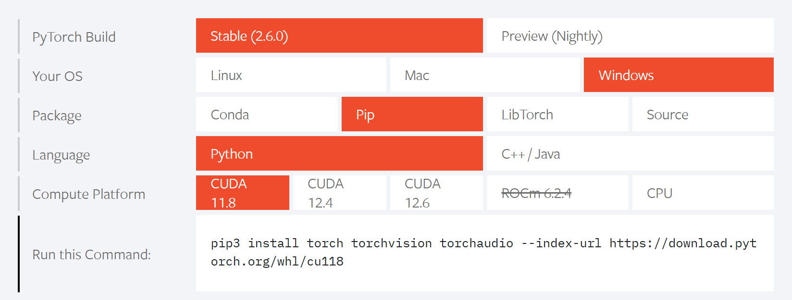
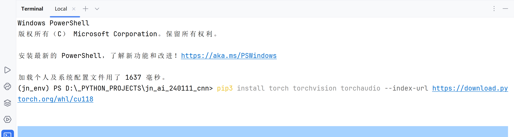
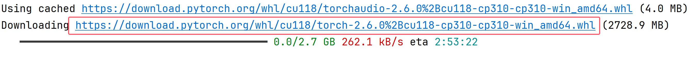
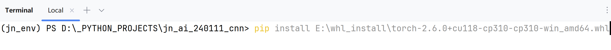
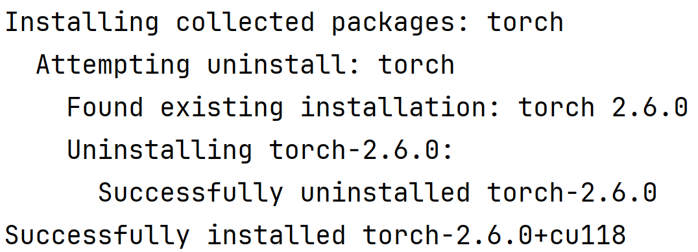

# GPU 训练


## GPU的环境安装

+ CUDA
+ CUDNN
+ torch+cu118


### CUDA安装

前置条件：检查电脑中是否有英伟达显卡

打开设备管理器：




CUDA11.8 ：[CUDA Toolkit 11.8 Downloads | NVIDIA Developer](https://developer.nvidia.com/cuda-11-8-0-download-archive)

CUDA12.4 :  [CUDA Toolkit 12.4 Downloads | NVIDIA Developer](https://developer.nvidia.com/cuda-12-4-0-download-archive)

CUDA12.6 ：[CUDA Toolkit 12.6 Downloads | NVIDIA Developer](https://developer.nvidia.com/cuda-12-6-0-download-archive?target_os=Windows)

（注意：像python3.8或者3.7 可能无法支持最新版的CUDA，但此处不影响CUDA安装，只是会导致torch无法使用GPU；低端显卡一般不支持CUDA12.6 ，比如GTX1660 ;  显卡的编号性能是不同的，因此在AI表现上不同）


此处以CUDA118为例：



下载完成后，直接双击安装CUDA，尽量安装到除C盘之外的其他盘（如果可以默认安装，就选择默认安装）。


### CUDNN安装

> 注意无论是Linux还是Windows都需要安装CUDNN

[cuDNN 历史版本 | NVIDIA 开发者](https://developer.nvidia.cn/rdp/cudnn-archive)

CUDA版本和CUDNN版本一定要对应，比如CUDA是12.4，CUDNN版本12.x


下载对应的Windows版本（注意是zip文件），此处点击后，需要先注册一个英伟达账号。



下载好压缩包之后，找到CUDA安装的根目录：



将CUDNN的压缩包，在CUDA上述根目录下解压


### torch 的GPU版本安装

torch的官方网页：[PyTorch](https://pytorch.org/)

根据下载的CUDA版本，选择torch版本，然后进行下载



将上述的指令粘贴到控制台中：



因为torch的gpu版本很大，因此我们时常将内容通过迅雷下载的方法，进行快速下载。

（复制下面的链接，到迅雷中）



迅雷下载之后，直接安装：



最后看到此处，就安装成功了




重新执行torch中的命令：

```
pip3 install torch torchvision torchaudio --index-url https://download.pytorch.org/whl/cu118
```

