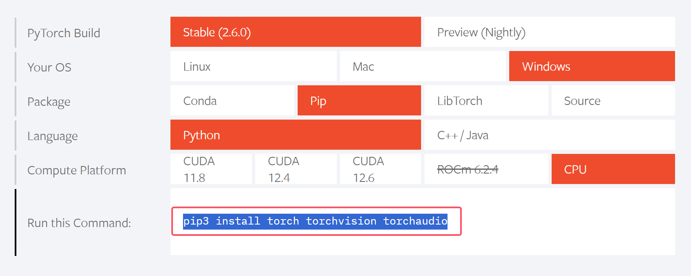
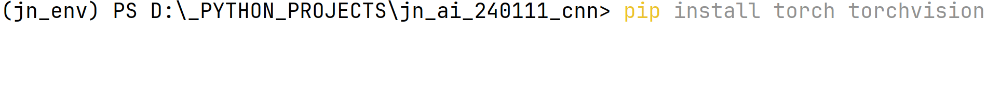

# 链式求导与全连接

## 关于torch的环境

进入pytorch官方网站[PyTorch](https://pytorch.org/?pStoreID=Http)

将上述指令复制粘贴到Terminial中

## 关于激活函数

+ sigmoid (0,1)

$$
y = \frac {1}{1 + e^{-x}}
$$

+ tanh (-1,1)

$$
y = \frac{e^{x} - e^{-x}}{e^{x} + e^{-x}}
$$

+ softmax (多分类)

$$
y = \frac {e^x}{\sum_{i=1}^{n}e^n}
$$

+ relu (更加复杂的卷积模型)

$$
y = \begin{cases} 0,x \lt 0 \\ x,x \ge 0 \end{cases}
$$

+ Leacky ReLU/ ReLu6 / hard-swish

